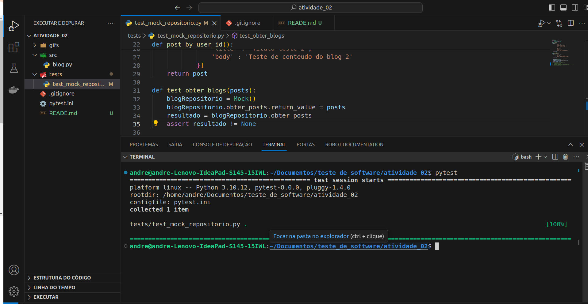

## Obter posts  
- Simulando erro "assert objeto None".  
|  

- Simulando sucesso "assert objeto diferente de None".  
|  

## post_by_user_id  
- Simulando erro "assert objeto None".  
|  

- Simulando sucesso "assert objeto diferente de None".  
|  